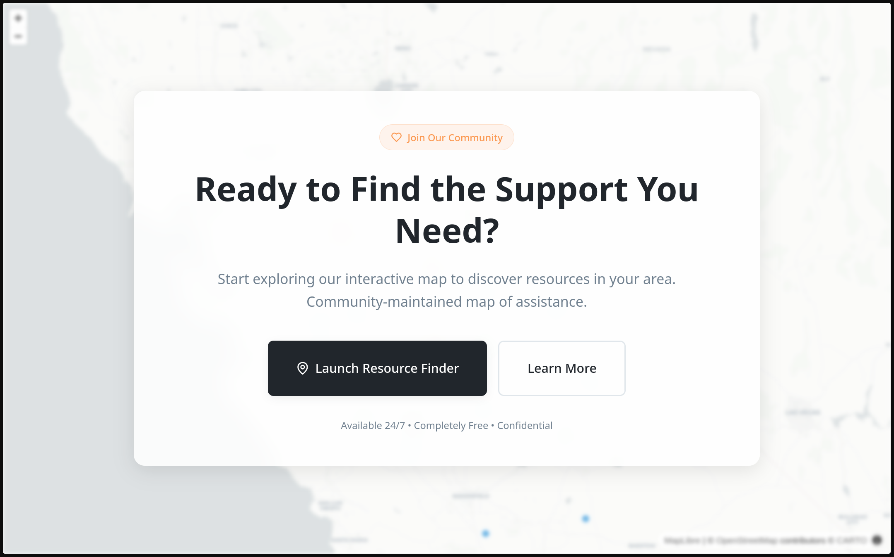
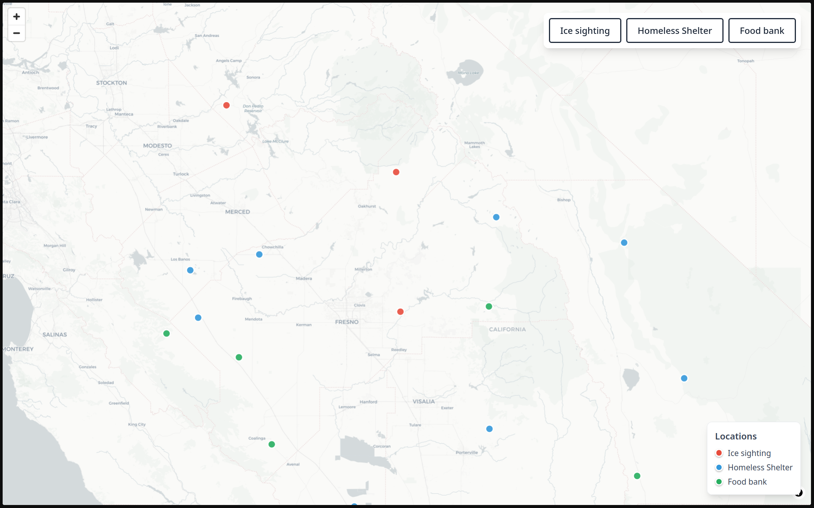
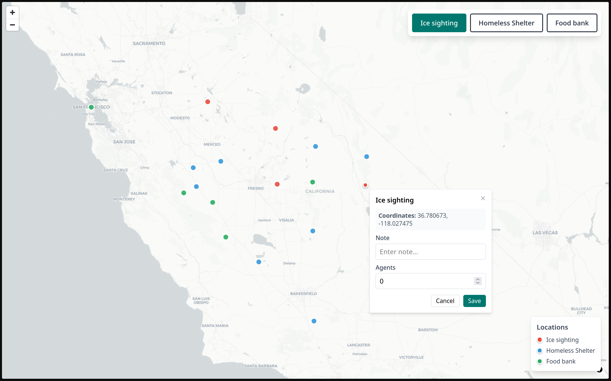
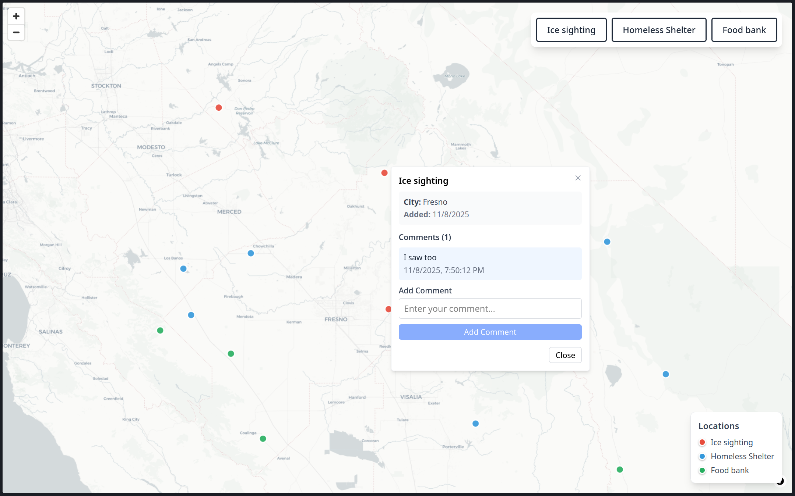

# Community Map

An interactive web application for mapping and tracking community resources across California, including ice sightings, homeless shelters, and food banks. Users can add locations, view existing markers, and engage through comments.

**HackCC 2025 Hackathon Entry** - Social Good Category

This project was created for the HackCC 2025 hackathon, addressing the need for transparent community resource tracking and reporting. By enabling users to document and share locations of community resources and concerns, this tool empowers communities to stay informed and support each other.

## Features

- **Interactive Map Interface**: MapLibre GL-based map of California with district boundaries
- **Location Management**: Add and view community resource locations with detailed information
- **Three Resource Types**:
  - Ice sightings (with agent count)
  - Homeless Shelters
  - Food Banks (with operating hours)
- **Comments System**: View location details and add comments to existing locations
- **Spatial Intelligence**: Automatic city detection based on coordinates using PostGIS
- **Visual Legend**: Color-coded pins and legend for easy resource identification
- **Real-time Updates**: Locations and comments update immediately after submission

## Screenshots

### Landing Page


### Main Map Interface


### Adding a Location


### Submission Form


### Food Bank Example


## Tech Stack

### Frontend
- **SvelteKit** - Full-stack web framework with server-side rendering
- **Svelte 5** - Modern reactive UI framework
- **MapLibre GL** - Open-source mapping library
- **Tailwind CSS** - Utility-first CSS framework
- **TypeScript** - Type-safe JavaScript

### Backend
- **PostgreSQL 18** - Relational database
- **PostGIS 3.6** - Spatial database extension for geographic queries
- **Martin** - High-performance map tile server
- **postgres.js** - PostgreSQL client for Node.js

## Setup

For complete installation and setup instructions, see [SETUP.md](SETUP.md).

Quick start:
```bash
docker compose up -d
pip install -r requirements.txt
python import_boundaries.py
cd community-map && npm install
npm run migrate
npm run dev
```

## Usage

### Adding a Location

1. Select a resource type from the toolbar (Ice sighting, Homeless Shelter, or Food Bank)
2. Click anywhere on the California map
3. A preview pin appears and a dialogue opens
4. Fill in the form:
   - **Note**: Optional description
   - **Agents**: Number of agents (ice sightings only)
   - **Hours**: Operating hours (Food banks only)
5. Click "Save" to add the location

### Viewing Location Details

1. Click on any existing location pin
2. View location information:
   - Resource type and nearest city
   - User-submitted notes
   - Additional fields (agents/hours)
   - Creation timestamp
3. Scroll through existing comments

### Adding Comments

1. Click on a location pin to open the details view
2. Type your comment in the "Add Comment" field
3. Click "Add Comment" to submit
4. Your comment appears immediately in the list

## API Reference

### Locations

#### GET /api/locations
Retrieve all locations.

**Response:**
```json
{
  "success": true,
  "data": [
    {
      "id": 1,
      "tool_type": "Ice sighting",
      "latitude": 34.0522,
      "longitude": -118.2437,
      "note": "Downtown facility",
      "agents": 5,
      "hours": null,
      "city_name": "Los Angeles",
      "created_at": "2025-11-08T..."
    }
  ]
}
```

#### POST /api/locations
Create a new location.

**Request:**
```json
{
  "tool": "Ice sighting",
  "coordinates": [-118.2437, 34.0522],
  "note": "Optional note",
  "agents": 5,
  "hours": null
}
```

**Response:** 201 Created
```json
{
  "success": true,
  "data": {
    "id": 1,
    "tool_type": "Ice sighting",
    "city_name": "Los Angeles",
    ...
  }
}
```

### Comments

#### GET /api/comments?location_id=1
Retrieve comments for a location.

**Response:**
```json
{
  "success": true,
  "data": [
    {
      "id": 1,
      "location_id": 1,
      "comment_text": "Important information here",
      "author_name": null,
      "created_at": "2025-11-08T..."
    }
  ]
}
```

#### POST /api/comments
Add a comment to a location.

**Request:**
```json
{
  "location_id": 1,
  "comment_text": "This is my comment",
  "author_name": null
}
```

**Response:** 201 Created

## Development

### Project Structure

```
community-map/
├── boundaries/              # GeoJSON boundary data
├── community-map/           # SvelteKit application
│   ├── src/
│   │   ├── lib/
│   │   │   ├── components/  # Svelte components
│   │   │   ├── server/      # Server-side utilities
│   │   │   └── stores/      # Svelte stores
│   │   └── routes/
│   │       ├── api/         # API endpoints
│   │       └── +page.svelte # Main page
│   ├── package.json
│   └── vite.config.ts
├── district_data/           # Additional district data
├── migrations/              # Database migration files
├── scripts/                 # Utility scripts
├── docker-compose.yaml      # Docker services configuration
├── import_boundaries.py     # Boundary import script
└── README.md
```

### Key Components

- **Map.svelte** - Main map interface with MapLibre GL
- **Toolbar.svelte** - Resource type selection buttons
- **ToolDialogue.svelte** - Location creation and viewing modal
- **Legend.svelte** - Map legend with color-coded resource types
- **mapTools.svelte.ts** - State management for map interactions

### Database Schema

**user_locations**
- Stores location markers
- PostGIS geometry column for spatial queries
- Automatic city name detection

**location_comments**
- One-to-many relationship with locations
- Cascade delete when location is removed
- Timestamp tracking with auto-update trigger

### Available Scripts

```bash
npm run dev        # Start development server
npm run build      # Build for production
npm run preview    # Preview production build
npm run check      # Run Svelte/TypeScript checks
npm run migrate    # Run database migrations
```

## Known Limitations

- No user authentication (all submissions are anonymous)
- No edit/delete functionality for locations or comments
- No pagination for comments (all load at once)
- No clustering for high-density areas
- No real-time updates (requires manual refresh)
- Limited to California boundaries

## Future Enhancements

- User authentication and authorization
- Edit/delete capabilities for locations and comments
- Comment moderation and flagging system
- Filtering by resource type and date range
- Location clustering for dense areas
- Real-time updates via WebSocket
- Mobile-responsive design improvements
- Export data to CSV/GeoJSON
- Admin dashboard for moderation
- Search and filter functionality

## License

This project is licensed under the ISC License - see the package.json file for details.

## Acknowledgments

- Built with SvelteKit and MapLibre GL
- Spatial data powered by PostGIS
- Boundary data from official California sources
- Map tiles served by Martin
